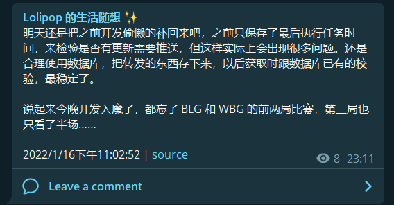
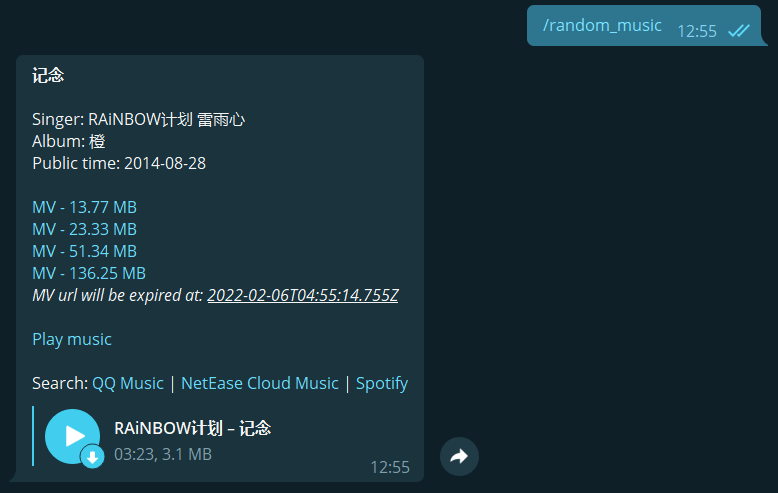

# telly-bot

## Init

Install required dependances.

```bash
npm install
```

### Environment variables

Create `.env` file in the project root directory and fill in the project configuration including [Telegram bot token](https://core.telegram.org/bots#6-botfather) and [webhook host](https://core.telegram.org/bots/api#setwebhook).

```bash
# Telegram bot settings. Must be set
TELEGRAM_BOT_TOKEN="Your Telegram Bot token"
WEBHOOK_HOST="Your server's public address (HTTPS protocol address is required)"
```

The following are optional environment variables, please fill in as required.

```bash
# Optional settings
PORT="Server listenning port (4000 by default)"
GITHUB_PERSONAL_ACCESS_TOKEN="Your Github account personal access token"

# SOCKS5 proxy settings
PROXY_SOCKS5_HOST="Your SOCKS5 host"
PROXY_SOCKS5_PORT="Your SOCKS5 port"
PROXY_SOCKS5_USERNAME="Your SOCKS5 username"
PROXY_SOCKS5_PASSWORD="Your SOCKS5 password"

# HTTP proxy settings (PROXY_SOCKS5 settings above will override these settings)
PROXY_HTTP_PROTOCOL="Your HTTP proxy protocol type"
PROXY_HTTP_HOST="Your HTTP proxy host"
PROXY_HTTP_PORT="Your HTTP proxy port"
PROXY_HTTP_USERNAME="Your HTTP proxy username"
PROXY_HTTP_PASSWORD="Your HTTP proxy password"
```

### Database configurations

Rename `config.template.js` to `config.js`. Modify the config file `config.js` as prompted to connect to the PostgreSQL database:

```js
database: {
    postgresql: {
        host: 'localhost',
        port: 5432,
        database: 'telly_bot_db',
        user: 'telly_bot_db_user',
        password: 'telly_bot_db_pwd',
        timezone: '+08:00',
    },
},
```

## Enable telly-bot features

### Forward Github issue comment to Telegram channel


You can enable Github issue comment forwarding service by configuring `config.js`:

```js
github: {
    forwardIssueComment: {
        enable: true,
        // Interval time(s) between execution of the next service
        duration: 3600,
        task: [
            {
                owner: 'github_repo_owner',
                repo: 'github_repo_name',
                issueNumber: 1,
                // Only forward the comments of these users, empty means forward all
                issueUserId: undefined,
                // The ID of the channel to which the comment was forwarded. Example: @lolipop_thoughts
                forwardChannelId: '@telegram_channel_id',
                // Forward comments from this date
                since: '2022-01-01T00:00:00.000Z',
            },
        ],
    },
},
```



This configuration means: the bot will automatically forward the comments of all users in `https://github.com/github_repo_owner/github_repo_name/issues/1` to the `@telegram_channel_id` channel, and the forwarded comments are last updated no earlier than `2022-01-01T00:00:00.000Z`. The execution interval between two services is `3600` seconds.

### Forward Hexo blog to Telegram chat


You can enable Github issue comment forwarding service by configuring `config.js`:

```js
hexo: {
    forwardHexoBlog: {
        enable: true,
        duration: 28800,
        task: [
            {
                // Path of Hexo blog posts directory
                path: 'path/to/source/_posts',
                baseUrl: 'https://your_username.github.io',
                // ':day' in permalink will be as ':day + offsetDay'
                offsetDay: 0,
                forwardChannelId: '@telegram_channel_id',
                // Since created date of blog
                since: '2022-01-01T00:00:00.000Z',
            },
        ],
    },
},
```


This configuration means: the bot will automatically forward the hexo blogs in `path/to/source/_posts` directory to the `@telegram_channel_id` channel, and the forwarded blog are created or updated no earlier than `2022-01-01T00:00:00.000Z`. The link jump to the blog will be as `https://your_username.github.io/${year}/${month}/${day + offsetDay}/${blog_filename}`. The execution interval between two services is `3600` seconds.

### Generate Pivix collection index and random send to Telegram chat

You can enable Github issue comment forwarding service by configuring `config.js`:

```js
pixiv: {
    generateCollectionIndex: {
        enable: true,
        duration: 3600,
        paths: [
            'pixiv_collection_path',
            { path: 'pixiv_collection_path_r18', r18: true },
        ],
    },
},
```


This configuration means: the server will automatically generate index for your Pivix collections stored in the `pixiv_collection_path` and `pixiv_collection_path_r18` paths every `3600` seconds. In that case, you can send message `/random_pixiv` or `/random_pixiv_r18` to the bot and get a random collection each time.

### QQ Music API support

Based on project [Rain120/qq-music-api](https://github.com/Rain120/qq-music-api).

You can enable QQ Music related services by configuring `config.js`:

```js
qqmusic: {
    enable: true,
    host: 'http://127.0.0.1',
    port: 3200,
    musicListId: 'your_music_list_id',
},
```



This configuration means: Rain120/qq-music-api server is running on `http://127.0.0.1:3200`. You can send message `/random_music` to the bot and get a random music from the QQ music playlist `your_music_list_id` each time.

## Development

```bash
npm run start
```

## Deployment

```bash
npm run pm2
```
